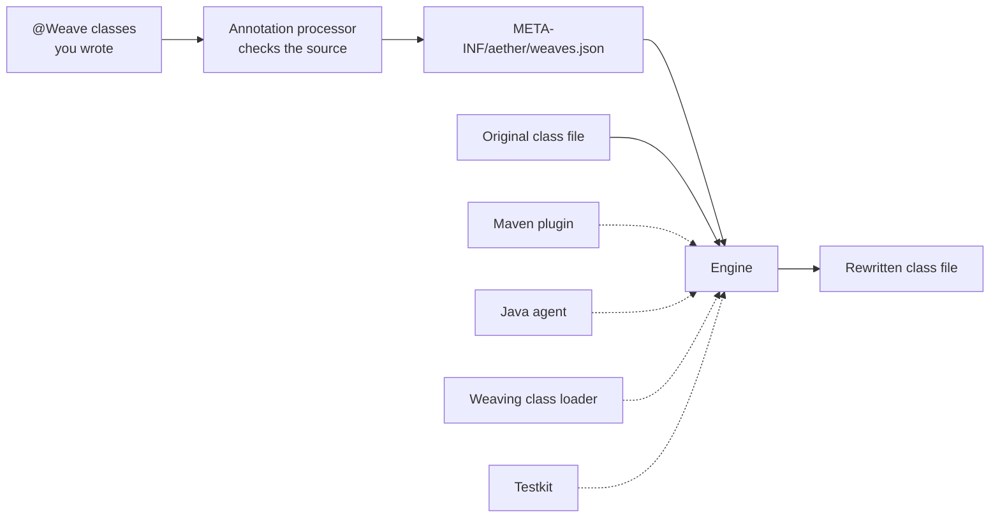

<div align="center">


<h1>Aether Weaver</h1>

<p><strong>Bytecode weaving for the JVM, built on the JDK's own Class-File API — and nothing else.</strong></p>

<p>
  <a href="https://central.sonatype.com/artifact/de.splatgames.aether.weaver/aether-weaver-api"></a>
  <a href="LICENSE"></a>
  <a href="https://openjdk.org/projects/jdk/25/"></a>
  <a href="https://github.com/aether-framework/aether-weaver/actions/workflows/build.yml"></a>
  <a href="https://github.com/aether-framework/aether-weaver/actions/workflows/codeql.yml"></a>
  <a href="https://software.splatgames.de/docs/aether-weaver/"></a>
</p>

</div>

## Overview

Aether Weaver changes what a compiled class does, without touching its source.

You write a **weave** — a plain Java class that says which classes it modifies and how. One engine
reads it and rewrites their bytecode. The classes you are changing never learn about it, and
neither does the code that calls them.

Four drivers decide *when* that happens: a Maven plugin at build time, a Java agent at load time, a
weaving class loader inside a running application, and a JUnit testkit in memory. The first three
are proven byte-for-byte identical by a test that weaves one fixture all three ways and compares
the results — because there is exactly one engine, and a driver only supplies bytes and lifecycle.

## 📋 Table of Contents

- [Why Aether Weaver](#-why-aether-weaver)
- [Quick Start](#-quick-start)
- [Installation](#-installation)
- [How It Works](#-how-it-works)
- [Key Concepts](#-key-concepts)
- [What a Weave Can Declare](#-what-a-weave-can-declare)
- [Drivers](#-drivers)
- [Modules](#-modules)
- [Testing Woven Code](#-testing-woven-code)
- [Diagnostics](#-diagnostics)
- [Extending the Engine](#-extending-the-engine)
- [IntelliJ IDEA Plugin](#-intellij-idea-plugin)
- [Documentation](#-documentation)
- [Building from Source](#-building-from-source)
- [Project Status](#-project-status)
- [Contributing](#-contributing)
- [Security](#-security)
- [License](#-license)

## ✨ Why Aether Weaver

- **🧬 The JDK's own Class-File API, exclusively.** No ASM, no Javassist, no Byte Buddy, no cglib —
  they are *banned dependencies* in every module, tests included, and the build fails if one turns
  up transitively. There is no shaded bytecode library inside this jar to collide with yours.
- **🪶 Nothing reaches your runtime classpath but Aether Weaver.** The annotations the framework
  compiles against have CLASS retention and `provided` scope, so nothing of theirs is there at run
  time either. What the Maven plugin and the testkit compile against — Maven's own API, JUnit —
  your build already has.
- **🔁 One engine, four drivers.** Build time, load time, in a running application, in a test. Same
  planner, same injectors, same verifier; a driver decides only where the bytes come from and when.
  Three of the four are proven byte-for-byte identical by a test.
- **🎯 Errors before bytes.** An annotation processor checks your weaves against the *source* at
  compile time, and the engine checks them again against the *class file*. Both speak the same
  catalogue of 132 numbered diagnostics, so a mistake has one code and one explanation wherever it
  is found.
- **🧩 An SPI, not a fork.** Injection points and injectors are plugin contributions, namespaced and
  isolated: a plugin that throws is contained and reported against *its* name, not the engine's.
- **📐 Reproducible on purpose.** Under one plan, one weaver version and one detail level, weaving
  the same class file gives back the same bytes. Nothing woven records where it was built, or when.

## 🚀 Quick Start

### 1. Add it to your build

```xml
<properties>
    <maven.compiler.release>25</maven.compiler.release>
    <aether.weaver.version>0.1.0</aether.weaver.version>
</properties>

<dependencyManagement>
    <dependencies>
        <dependency>
            <groupId>de.splatgames.aether.weaver</groupId>
            <artifactId>aether-weaver-bom</artifactId>
            <version>${aether.weaver.version}</version>
            <type>pom</type>
            <scope>import</scope>
        </dependency>
    </dependencies>
</dependencyManagement>

<dependencies>
    <dependency>
        <groupId>de.splatgames.aether.weaver</groupId>
        <artifactId>aether-weaver-api</artifactId>
    </dependency>
    <dependency>
        <groupId>de.splatgames.aether.weaver</groupId>
        <artifactId>aether-weaver-processor</artifactId>
        <scope>provided</scope>
    </dependency>
</dependencies>

<build>
    <plugins>
        <plugin>
            <groupId>org.apache.maven.plugins</groupId>
            <artifactId>maven-compiler-plugin</artifactId>
            <version>3.14.0</version>
            <configuration>
                <proc>full</proc>
            </configuration>
        </plugin>
        <plugin>
            <groupId>de.splatgames.aether.weaver</groupId>
            <artifactId>aether-weaver-maven-plugin</artifactId>
            <version>${aether.weaver.version}</version>
            <executions>
                <execution>
                    <goals>
                        <goal>weave</goal>
                    </goals>
                </execution>
            </executions>
        </plugin>
    </plugins>
</build>
```

> [!IMPORTANT]
> Both the processor **and** `<proc>full</proc>` are load-bearing. Current `javac` releases do not
> run a classpath annotation processor unless asked, and the processor is what writes the manifest
> the plugin reads. Leave either one out and the build stays green and weaves nothing.

### 2. Write the class you want to change

```java
package fixture;

public class Target {

    public String greet() {
        return "hello";
    }
}
```

### 3. Write the weave

```java
package fixture;

import de.splatgames.aether.weaver.api.At;
import de.splatgames.aether.weaver.api.Inject;
import de.splatgames.aether.weaver.api.Point;
import de.splatgames.aether.weaver.api.Weave;

@Weave(Target.class)
public final class Audit {

    @Inject(method = "greet()", at = @At(Point.HEAD))
    void onGreet() {
        System.out.println("woven");
    }
}
```

`@Weave(Target.class)` names what this modifies. `method = "greet()"` is a **selector**: the method
named `greet` that takes no parameters. `@At(Point.HEAD)` is *where* — the first instruction.

### 4. Build and run

```java
package fixture;

public class Main {

    public static void main(String[] args) {
        new Target().greet();
    }
}
```

```bash
mvn verify
java -cp target/classes fixture.Main
```

```
woven
```

`Target.greet()` still returns `"hello"`. It now runs your handler first, and nothing that calls it
had to change. `Audit` itself never loads at run time: an instance weave is dissolved into each
target it names.

➡️ The long version, with everything explained:
**[Your first weave](https://software.splatgames.de/docs/aether-weaver/latest/first-weave.html)**.

## 📦 Installation

The BOM keeps every Aether Weaver version in one place. Import it, then declare artefacts without a
`<version>`:

```xml
<dependencyManagement>
    <dependencies>
        <dependency>
            <groupId>de.splatgames.aether.weaver</groupId>
            <artifactId>aether-weaver-bom</artifactId>
            <version>0.1.0</version>
            <type>pom</type>
            <scope>import</scope>
        </dependency>
    </dependencies>
</dependencyManagement>
```

The Maven plugin is deliberately *not* in the BOM: `dependencyManagement` never versions a
`<plugin>` element, so the plugin carries its own `<version>`.

<details>
<summary>Gradle (Kotlin / Groovy)</summary>

```kotlin
dependencies {
    implementation(platform("de.splatgames.aether.weaver:aether-weaver-bom:0.1.0"))
    implementation("de.splatgames.aether.weaver:aether-weaver-api")
    annotationProcessor("de.splatgames.aether.weaver:aether-weaver-processor")
}
```

```groovy
dependencies {
    implementation platform('de.splatgames.aether.weaver:aether-weaver-bom:0.1.0')
    implementation 'de.splatgames.aether.weaver:aether-weaver-api'
    annotationProcessor 'de.splatgames.aether.weaver:aether-weaver-processor'
}
```

There is no Gradle plugin yet. Gradle builds can declare weaves and have them checked at compile
time; to apply them, run the [agent](https://software.splatgames.de/docs/aether-weaver/latest/load-time-weaving.html)
or the [runtime driver](https://software.splatgames.de/docs/aether-weaver/latest/runtime-weaving.html).

</details>

Requires **JDK 25** and, for build-time weaving, **Maven 3.9**. The Maven plugin declares that
floor as a prerequisite, so an older Maven refuses it by name.

## 🧩 How It Works



The engine is a `byte[]` to `byte[]` function. It parses the target, resolves what each weave
selected, plans every modification in a deterministic order, applies them through injectors, and
verifies the result before handing the bytes back. A driver contributes only two things: where the
bytes come from, and when the call happens.

That is why the drivers agree. There is nothing per-driver left to disagree about.

## 🔑 Key Concepts

| Concept | What it is |
|---|---|
| **Weave** | A plain Java class annotated `@Weave`, naming the classes it modifies |
| **Target** | A class a weave names — by class literal or by binary name, never both |
| **Handler** | A method in the weave that the engine calls from inside the target |
| **Selector** | The grammar that picks members: `greet()`, `Gateway.send(Payment)`, `get():String`, `*(*)` |
| **Injection point** | *Where* inside a method — `HEAD`, `RETURN`, `INVOKE`, `NEW`, `THROW`, and four more |
| **Injector** | *What* happens there — inject, redirect, wrap, or a structural merge |
| **Driver** | *When* the weaving runs — build time, load time, runtime, or a test |
| **Diagnostic** | One numbered `AW####` code, one severity, one explanation |
| **Plan** | The ordered list of modifications for one class, decided before a byte is written |
| **Policy** | The gate that can refuse a class outright, before anything is rewritten |

## 🎯 What a Weave Can Declare

| Annotation | Effect |
|---|---|
| `@Inject` | Runs your handler *inside* the target method. The matched instruction still runs |
| `@Redirect` | Replaces one operation — a call, a field access, a `new`. The original never happens |
| `@Wrap` | Hands the operation to your handler as an `Operation` it may perform, repeat or skip |
| `@Shadow` | Declares a member the target already has, so your handler can use it |
| `@Unique` | Adds a member that is guaranteed not to collide with the target's own |
| `@Accessor` / `@Invoker` | Reaches a field or a method the target keeps to itself |
| `@Local` | Captures a local variable of the target method, optionally writing it back |
| `@At` | Where in the method body the injection lands — a `Point`, a slice, an ordinal, a shift |
| `@Group` | Lets several declarations answer for one another, and bounds how many had to match |

📖 Every parameter of every one of them:
**[Annotation reference](https://software.splatgames.de/docs/aether-weaver/latest/annotations.html)**.

## 🚗 Drivers

| Driver | Artefact | Weaves | Use it when |
|---|---|---|---|
| **Maven plugin** | `aether-weaver-maven-plugin` | at `process-classes` | You ship woven classes and want nothing at run time |
| **Java agent** | `aether-weaver-agent` | as classes are defined | You cannot change the build, or the target is not yours |
| **Weaving class loader** | `aether-weaver-runtime` | inside a running application | You load plugins, mods or extensions yourself |
| **Testkit** | `aether-weaver-testkit` | in memory, in a JUnit test | You want to assert on the woven class, redefining nothing |

The Maven plugin, the agent and the weaving class loader produce **byte-identical output** — an
end-to-end test weaves one fixture through all three and compares SHA-256 digests, and a second
test asserts the fixture really was modified, so three drivers that all did nothing cannot pass it.

🧭 Which one you want:
**[Choose a driver](https://software.splatgames.de/docs/aether-weaver/latest/choose-a-driver.html)**.

## 📦 Modules

Nine Maven modules, seven of them published as jars, plus a BOM. The dependency arrow points one
way — `api <- engine <- drivers` — and an architecture test reads `import` lines to keep it that
way.

| Artefact | What it is | You depend on it |
|---|---|---|
| [`aether-weaver-bom`](aether-weaver-bom) | Bill of materials for every artefact below | **Yes** — imported |
| [`aether-weaver-api`](aether-weaver-api) | Annotations, selector grammar, SPI contracts, diagnostic codes | **Yes** — a weave compiles against it |
| [`aether-weaver-engine`](aether-weaver-engine) | The `byte[]` to `byte[]` engine: parsing, resolution, planning, injection, verification | Transitively, with any driver |
| [`aether-weaver-processor`](aether-weaver-processor) | JSR 269 processor: compile-time validation and the weave manifest | **Yes** — `provided` |
| [`aether-weaver-maven-plugin`](aether-weaver-maven-plugin) | Weaves compiled classes at build time. Four goals | **Yes** — as a `<plugin>` |
| [`aether-weaver-agent`](aether-weaver-agent) | `premain`, `agentmain` and the `ClassFileTransformer` | As a `-javaagent` jar |
| [`aether-weaver-runtime`](aether-weaver-runtime) | Weaver facade, weaving class loader, classpath discovery | For the class-loader driver |
| [`aether-weaver-testkit`](aether-weaver-testkit) | JUnit 5 extension, bytecode assertions, in-memory weaving | **Yes** — `test` scope |
| [`aether-weaver-tests`](aether-weaver-tests) | Cross-module, end-to-end and architecture tests | Never — not published |
| [`aether-weaver-ide`](aether-weaver-ide) | The IntelliJ IDEA plugin. A Gradle build, outside the reactor | Not published |

📖 What each one puts on your classpath:
**[Artefacts and modules](https://software.splatgames.de/docs/aether-weaver/latest/artifacts.html)**.

## 🧪 Testing Woven Code

The testkit weaves in memory. Nothing is redefined, nothing is written to disk, and the assertions
know what a woven class is supposed to look like.

```java
@ExtendWith(WeaverExtension.class)
@Weaves(Audit.class)
class AuditTest {

    @Test
    void greetRunsTheHandler(final Weaving weaving) {
        final WeaveResult result = weaving.weave(Target.class);

        assertThatWoven(result)
                .wasWoven()
                .reportsNothing(Severity.WARNING)
                .satisfiesEveryInvariant()
                .loadsAndRuns(AuditTest::stillGreets);
    }

    static void stillGreets(final Class<?> woven) throws Exception {
        final Object it = woven.getDeclaredConstructor().newInstance();
        assertEquals("hello", woven.getMethod("greet").invoke(it));
    }
}
```

There are golden-file assertions too, for when you want the *bytes* reviewed rather than the
behaviour.

📖 **[Testing woven code](https://software.splatgames.de/docs/aether-weaver/latest/testing-woven-code.html)**.

## 🔍 Diagnostics

Every refusal, warning and note the framework can produce is one constant in one enum: **132 codes**
— 127 reportable and 5 reserved — banded by number into 13 categories, each carrying its own default
severity and category rather than deriving them from its digits.

| Band | Category | Example |
|---|---|---|
| `AW1000`–`AW1099` | Declaration — the weave itself is wrong | `AW1041` handler return type is not `void` |
| `AW1100`–`AW1199` | Injection point — *where* cannot be resolved | `AW1102` shift not supported by this point |
| `AW1300`–`AW1399` | Extension methods | `AW1300` extension class is not `final` |
| `AW2300`–`AW2399` | Configuration | `AW2310` unknown configuration key |
| `AW2400`–`AW2499` | Environment | `AW2401` weaving class loader used with an active AOT cache |
| `AW3000`–`AW3099` | Policy — the class was refused before rewriting | `AW3001` target is in a denied JDK package |
| `AW3100`–`AW3199` | Plugin — a contribution misbehaved | `AW3115` plugin threw while registering its contributions |
| `AW4000`+ | Engine — verification found something wrong | `AW4004` structural self-check failed |

The annotation processor and the engine report the *same* code for the same mistake, so a diagnostic
you learn once means the same thing at compile time, at build time and at load time.

📖 Every code, its severity and its remedy:
**[Diagnostics reference](https://software.splatgames.de/docs/aether-weaver/latest/diagnostics.html)**.

## 🧠 Extending the Engine

Injection points and injectors are not a closed set. A `WeaverPlugin` contributes new ones under its
own namespace, and a weave names them as `@At(custom = "acme:AFTER_LOGGING")`.

```java
public final class AcmePlugin implements WeaverPlugin {

    private static final PluginId ID = new PluginId("acme", "Acme Points", "1.0");

    @Override
    public PluginId id() {
        return ID;
    }

    @Override
    public int apiLevel() {
        return WeaverApi.LEVEL;
    }

    @Override
    public void contribute(PluginContext ctx) {
        ctx.points(new AcmePoints());
    }
}
```

`AcmePoints` is an `InjectionPointFactory` — it declares the namespace it owns, the ids it answers
for, and builds the `InjectionPoint` behind each one.

Contributions are namespaced, so two plugins cannot collide, and they run inside a guard: a plugin
that throws is contained, and the diagnostic names the plugin rather than the engine.

> [!NOTE]
> A plugin is installed by a program that builds its own `Weaver` — `Weaver.builder().plugin(…)` or
> `discoverPlugins(loader)`. The shipped drivers do not scan the classpath for third-party plugins,
> so dropping a plugin jar next to the Maven plugin or the agent does not extend them.

📖 **[Extending the engine](https://software.splatgames.de/docs/aether-weaver/latest/plugins.html)**.

## 💻 IntelliJ IDEA Plugin

The IDE plugin shows you the class the build produces. It changes no bytes.

Completion for merged members and selectors, six inspections with quick fixes that share their
codes with the annotation processor, gutter markers in both directions between a weave and its
target, inlay hints showing where injected code lands, and a *Weaves* tool window.

It is a separate Gradle build outside the Maven reactor — building an IntelliJ plugin downloads a
full IDE distribution, and `mvn install` must never depend on that. It is not published yet; build
it from [`aether-weaver-ide`](aether-weaver-ide).

📖 **[The IntelliJ IDEA plugin](https://software.splatgames.de/docs/aether-weaver/latest/intellij-plugin.html)**.

## 📚 Documentation

The full documentation site lives at
**[software.splatgames.de/docs/aether-weaver](https://software.splatgames.de/docs/aether-weaver/)** —
58 pages. Every change to it is built by the real Writerside builder in CI and fails on any error
or warning its report carries, dead links and anchors included.

| Section | What is in it |
|---|---|
| [Getting started](https://software.splatgames.de/docs/aether-weaver/latest/getting-started.html) | From an empty pom to a class a weave has modified |
| [Concepts](https://software.splatgames.de/docs/aether-weaver/latest/concepts.html) | How the framework works, and why it behaves the way it does |
| [Guides](https://software.splatgames.de/docs/aether-weaver/latest/guides.html) | One task per page, with the whole configuration it needs |
| [Extending the engine](https://software.splatgames.de/docs/aether-weaver/latest/plugins.html) | What a `WeaverPlugin` may contribute, how it loads, how it fails |
| [Reference](https://software.splatgames.de/docs/aether-weaver/latest/reference.html) | Every annotation, parameter, goal, configuration key and diagnostic |
| [Tooling](https://software.splatgames.de/docs/aether-weaver/latest/tooling.html) | Editor integration |
| [Contributing](https://software.splatgames.de/docs/aether-weaver/latest/contributing.html) | The repository, the build, the standards |

Every public, protected, package-private and private member of the seven published modules carries
JavaDoc, and a test fails the build when one does not.

## 🔨 Building from Source

```bash
git clone https://github.com/aether-framework/aether-weaver.git
cd aether-weaver
mvn -B clean verify
```

JDK 25 and Maven 3.9 or newer. `verify` is the whole gate: the enforcer (banned dependencies, Java
version), Checkstyle over main *and* test sources, every module's tests — over 1,100 of them — the
architecture tests that read `import` lines, and a JavaDoc pass that resolves every `{@link}` and
fails on a warning.

CI additionally builds on Linux, Windows and macOS, proves the build is reproducible by comparing
two clean builds jar by jar, runs the suite under `tr-TR` / `Asia/Tokyo` to catch locale
assumptions, and tries the next JDK early-access build for warning.

📖 **[Building and testing](https://software.splatgames.de/docs/aether-weaver/latest/building-and-testing.html)**.

## 🧭 Project Status

**0.1.0 is the first release.** The core is complete and heavily tested; the shape of the public API
is what the annotations, the selector grammar and the SPI describe. A few things are deliberately
marked, and it is worth knowing which:

- **`api.experimental` is experimental**, and says so on every type in it. Extension methods live
  there. No compatibility guarantee is stated for those declarations.
- **The IntelliJ plugin is not published** to the JetBrains Marketplace yet. Build it from source.
- **There is no Gradle plugin.** Weaving from a Gradle build means the agent or the runtime driver.
- **Plugin discovery is opt-in**, by a program that builds its own `Weaver`. See the note above.

Semantic versioning applies from 0.1.0 onward. Breaking changes are listed in
[CHANGELOG.md](CHANGELOG.md) with the migration step.

## 🤝 Contributing

Contributions are welcome — code, tests, documentation, or a reproducer that turns a vague report
into a fixable one.

Start with **[CONTRIBUTING.md](CONTRIBUTING.md)**: what to install, the one command that has to stay
green, and the four rules the build enforces rather than trusting to review. Commits are signed off
under the [DCO](DCO), and AI-assisted work is welcome under [AI_USAGE.md](AI_USAGE.md).

Everyone taking part follows the [Code of Conduct](CODE_OF_CONDUCT.md).

## 🔒 Security

Aether Weaver rewrites bytecode and, under the agent, runs inside the JVM it modifies. The
[security policy](SECURITY.md) says what that means, what the standard policy refuses before any
byte is written, and what stays your responsibility.

Release artefacts on Maven Central are GPG signed. The public key is in [`KEYS`](KEYS), and its
fingerprint is `C6BE 25BF 2A46 39A6 7A49  1EBD 37B5 9B93 DC75 6EE8`:

```bash
gpg --import KEYS
gpg --verify aether-weaver-api-0.1.0.jar.asc aether-weaver-api-0.1.0.jar
```

[Signing keys](SECURITY.md#signing-keys) has the rest, including why you should check that
fingerprint somewhere other than here.

Report vulnerabilities **privately** —
[GitHub Security Advisories](https://github.com/aether-framework/aether-weaver/security/advisories/new)
or `security@splatgames.de`. Never in a public issue.

## 📄 License

Released under the [MIT License](LICENSE).

Copyright (c) 2026 [Splatgames.de Software](https://software.splatgames.de) and Contributors.
